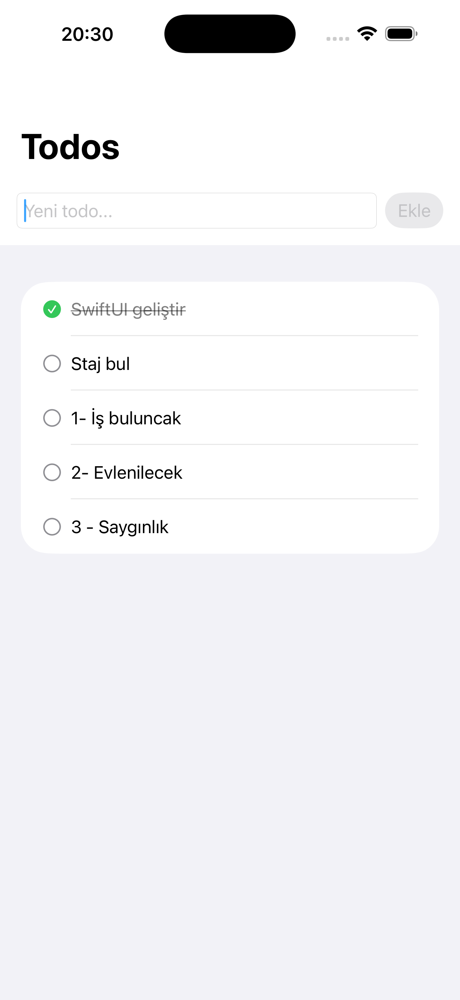

# TodoApp — Clean MVVM

A Day 1 Clean Architecture assignment. Runs with in-memory data, no network required.


  

## What's Built

- `TodoItem` entity — pure Swift struct, lives in Domain layer
- `TodoRepositoryProtocol` — contract that decouples Data from Domain
- `FetchTodosUseCase` & `AddTodoUseCase` — single-responsibility business logic
- `MockTodoRepository` — in-memory storage, implements the protocol
- `TodoListViewModel` — state management with `@MainActor` & `@Published`
- `TodoListView` — SwiftUI only, zero business logic
- `AppComposer` — all dependencies wired in one place

## Architecture
```
View → ViewModel → UseCase → Protocol ← MockRepository
```

## Notes

- Data resets on app restart (in-memory)
- Empty todo prevention handled in UseCase, not in View
- Day 2 will add `async/await` + `ViewState` enum


