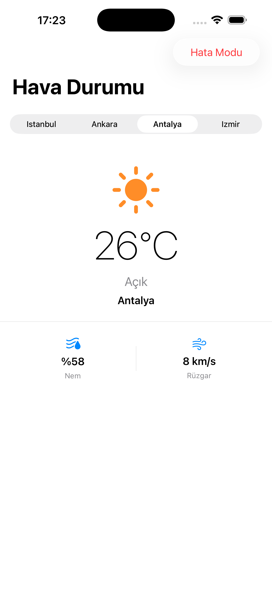
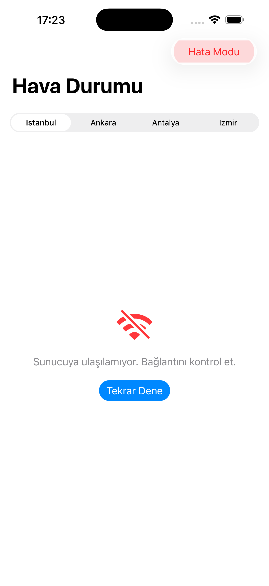

# WeatherApp — Async/Await + ViewState

A Day 2 async/await assignment. Simulates a weather API with loading, success, and error states.

<p align="center">
  
  &nbsp;&nbsp;
  
</p>

## What's Built

- `WeatherInfo` entity — pure Swift struct, lives in Domain layer
- `WeatherRepositoryProtocol` — contract that decouples Data from Domain
- `MockWeatherRepository` — simulates network with `Task.sleep`, throws on demand
- `ViewState<T>` enum — idle / loading / success / failure, no inconsistent state possible
- `WeatherViewModel` — `@MainActor`, `Task` lifecycle management, retry logic
- `WeatherView` — exhaustive switch on state, zero business logic

## Architecture
```
View → ViewModel → Protocol ← MockRepository
```

## Key Concepts Applied

- `async/await` with `Task` — fetch triggered on appear, city change, and retry
- `Task.cancel()` on disappear and city switch — no duplicate requests
- `ViewState<T>` enum — replaces Bool flag approach, compiler enforces all states
- Error simulation toggle — switch between success and failure flows at runtime

## Notes

- Data resets on app restart (in-memory mock)
- 1.5s artificial delay simulates real network latency
- Day 3 will add Combine pipelines for reactive calculations
