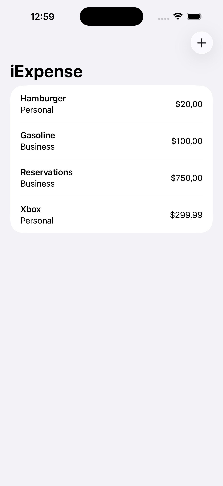
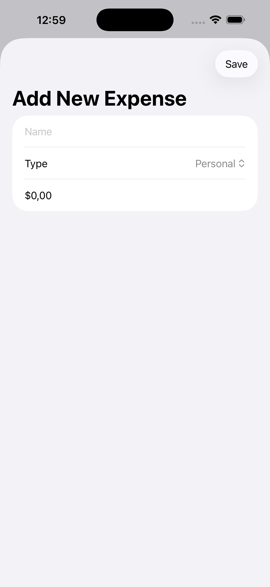

# iExpense SwiftUI Projesi

Bu projede SwiftUI ile kişisel harcamalarınızı yönetebileceğiniz bir uygulama geliştirilmiştir.

## Kullanılan Temel Özellikler ve Yapılar

- **UserDefaults & @AppStorage**: Kullanıcı verileri (örneğin; harcama listeleri) uygulamadan çıkıldığında kalıcı olarak saklanır.
- **@Environment**: Sistem çevre değişkenlerine erişilir, tema ve renk değişimleri gibi işlemler yönetilir.
- **@Observable**: Harcama listesinde yapılan değişikliklerde arayüzün otomatik olarak güncellenmesi sağlanır.
- **Codable & Identifiable**: Harcama verileri kolayca serileştirilebilir ve her harcamanın benzersiz bir kimliği olur.

## Ekran Görüntüleri

  
  

